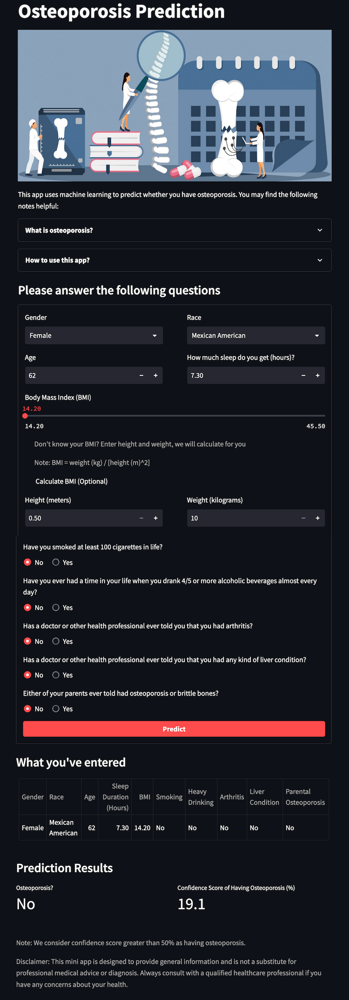

# Osteoporosis Prediction

[Osteoporosis Prediction App](https://osteoporosis-prediction.streamlit.app/) is a web app that uses machine learning to predict whether you have [osteoporosis](https://www.nia.nih.gov/health/osteoporosis).

  

## Description

It is based on Neural Networks that being trained by the National Health and Nutrition Examination Survey (NHANES) data.
You can find how the data was preprocessed on [Predicting Osteoporosis using NHANES Data](https://github.com/eeliuqin/Osteoporosis-Analysis-and-Prediction-on-NHANES-Data).
